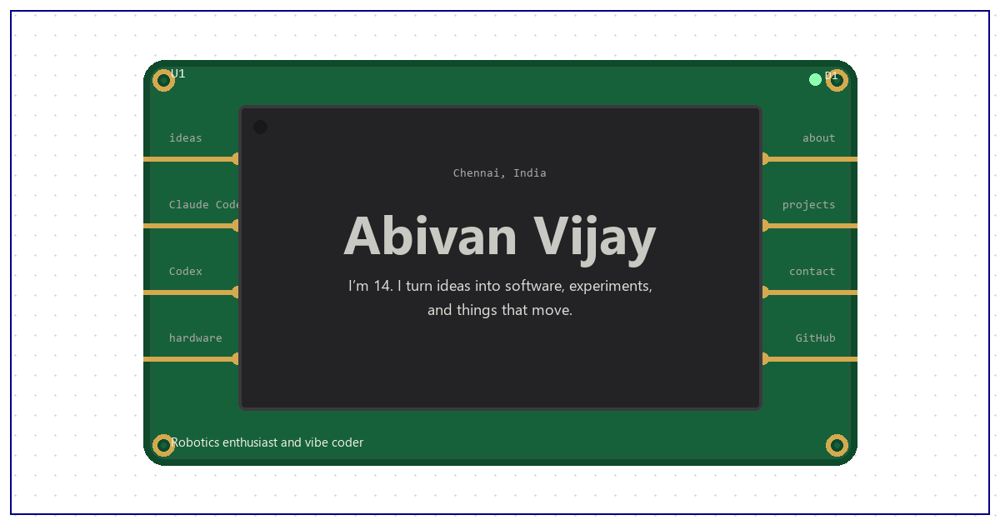

<div align="center">

<a href="https://abivan-dev.vercel.app/">
  
</a>

<h1>Abivan Vijay</h1>

<p>Robots, ESP32 hardware and web apps, built in Chennai, India.<br />
This repository is the portfolio that shows them, drawn as a KiCad schematic.</p>

<p><a href="https://abivan-dev.vercel.app/"><b>Visit abivan-dev.vercel.app</b></a></p>

</div>

<br />

## About the site

The portfolio is drawn in the vocabulary of electronics design. Abivan is part **U1**, a chip you can view as a schematic symbol or as a fabricated board. Sections are joined by net labels, each project is a sub-sheet, results sit on the timeline as numbered test points, and the toolkit is a parts cabinet of labelled drawers.

| Page | Address | Contents |
| :-- | :-- | :-- |
| Home | [`/`](https://abivan-dev.vercel.app/) | About, a timeline of results and upcoming events, featured projects, and contact details |
| Projects | [`/projects/`](https://abivan-dev.vercel.app/projects/) | Every project, with Hardware and Software filters |
| Toolkit | [`/toolkit/`](https://abivan-dev.vercel.app/toolkit/) | The boards, parts and software behind the projects, sorted into drawers that open to show where each is used |

Every page is pre-rendered to static HTML at build time, so content is in place before any JavaScript runs and the host needs no rewrite rules. Layouts adapt to small screens, work with a keyboard, and respect reduced-motion preferences.

## Run it locally

You need Node.js 20.19+ or 22.12+ (the versions Vite 8 supports) and npm.

```sh
git clone https://github.com/abivan100-stack/abivan-portfolio.git
cd abivan-portfolio
npm install
npm run dev
```

The project list is committed, so the dev server works without a GitHub sync. Run `npm run sync:projects` to pull the latest project details.

| Command | What it does |
| :-- | :-- |
| `npm run dev` | Starts the Vite development server |
| `npm run sync:projects` | Refreshes `src/data/projects.json` from GitHub |
| `npm run build` | Syncs projects, type-checks, builds the site and pre-renders every page into `dist/` |
| `npm run preview` | Serves the production build locally |
| `npm run lint` | Lints the code with oxlint |
| `npm run cv` | Prints the CV to `public/abivan-vijay-cv.pdf` with a local Chrome or Edge (set `CHROME_PATH` to use another) |

### Building without GitHub

`npm run build` stops with an error if the GitHub sync fails, so a deploy never ships outdated project data by accident. Two environment variables change how the sync runs:

| Variable | Effect |
| :-- | :-- |
| `GITHUB_TOKEN` | Optional. Sends GitHub API requests with this token, which raises the rate limit. |
| `ALLOW_STALE_PROJECT_SNAPSHOT=1` | Builds offline from the committed project list, after checking that it is complete. A warning notes the fallback. |

## Where the content lives

| Content | Edit it in |
| :-- | :-- |
| Details of the synced GitHub projects | The project repositories themselves. `sync-projects.mjs` reads their GitHub metadata and READMEs. |
| Which repositories are synced, fallback demo links, projects without a repository, and results with their dates | `scripts/sync-projects.mjs` |
| Featured projects and shared links | `src/lib/portfolio.ts` |
| Timeline events not tied to a project | `src/data/events.json` |
| Toolkit entries | `src/data/toolkit.json` |
| The one-page CV | `cv/abivan-vijay-cv.html`, then run `npm run cv` and commit the new PDF |

`src/data/projects.json` is generated by the sync script. Don't edit it by hand, because the next sync overwrites it.

## Project layout

```text
.
├── index.html              Home page entry
├── projects/index.html     Projects page entry
├── toolkit/index.html      Toolkit page entry
├── cv/                     One-page CV, printed to PDF by npm run cv
├── public/                 Favicon, social preview image and CV PDF
├── scripts/
│   ├── build-cv.mjs        Prints the CV to public/abivan-vijay-cv.pdf
│   ├── sync-projects.mjs   GitHub sync and curated project data
│   └── prerender.mjs       Renders each page to static HTML
└── src/
    ├── App.tsx             Home page
    ├── ProjectsPage.tsx    Projects page
    ├── ToolkitPage.tsx     Toolkit page
    ├── entry-server.tsx    Server entry used for pre-rendering
    ├── components/         Sheet frame, project sub-sheets and toolkit drawers
    ├── data/               Projects, events and toolkit data
    └── lib/                Portfolio settings, hooks and date helpers
```

Built with [React](https://react.dev/), [TypeScript](https://www.typescriptlang.org/) and [Vite](https://vite.dev/), linted with [oxlint](https://oxc.rs/), fed by the [GitHub REST API](https://docs.github.com/en/rest), and hosted on [Vercel](https://vercel.com/).

<br />

<table>
  <tr>
    <td><sub>Title</sub><br /><b>Abivan Vijay, portfolio</b></td>
    <td><sub>Drawn by</sub><br /><a href="https://github.com/abivan100-stack">Abivan Vijay</a></td>
  </tr>
  <tr>
    <td><sub>Sheets</sub><br />Home, Projects, Toolkit</td>
    <td><sub>Contact</sub><br /><a href="mailto:abivan100@gmail.com">abivan100@gmail.com</a></td>
  </tr>
</table>
